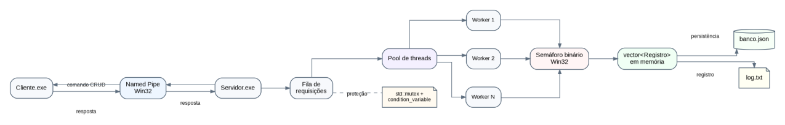
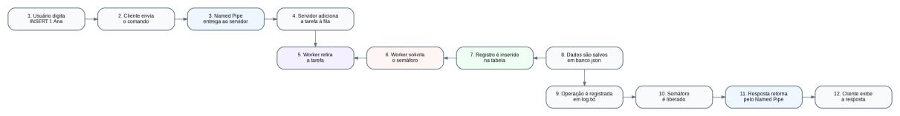

# Sistema de Processamento Paralelo de Requisições a um Banco de Dados

**Universidade do Vale do Itajaí — UNIVALI**  
**Disciplina:** Sistemas Operacionais  
**Avaliação:** M1 — IPC, Threads e Paralelismo  
**Autores:** Thiago Wyse, Vitor Hugo e Matheus Bertemes  
**Data dos experimentos:** 19 de setembro de 2026  
**Prazo informado no enunciado:** 21 de setembro de 2026, às 23h59

## Relatório e diagramas

- [Relatório completo em PDF](docs/Relatorio_M1_Sistemas_Operacionais.pdf)
- [Arquitetura geral do sistema](docs/imagens/arquitetura-sistema.png)
- [Fluxo de uma requisição INSERT](docs/imagens/fluxo-requisicao.png)

## Resumo

Este trabalho implementa um gerenciador simplificado de requisições a um banco
de dados em C++17 para Windows. Cliente e servidor executam como processos
distintos e comunicam-se por Named Pipe. O servidor distribui as requisições
entre threads de um pool fixo e protege a tabela compartilhada com um semáforo
binário. A aplicação permite inserir, consultar, atualizar e excluir registros
em tempo real, com persistência manual em JSON e registro das operações em log.
Os experimentos incluíram testes funcionais, disputa pelo mesmo identificador
e 3.600 operações distribuídas entre configurações de uma, duas e quatro threads.
Na carga avaliada, quatro threads apresentaram o menor tempo médio, embora o
acesso à tabela continue serializado.

**Palavras-chave:** sistemas operacionais; IPC; threads; exclusão mútua; Named Pipe.

## 1. Problema e objetivos

O enunciado propõe simular o funcionamento interno de um gerenciador de
requisições a um banco de dados. Um processo cliente envia operações por IPC;
outro processo recebe essas operações e utiliza múltiplas threads para
processá-las. O acesso à estrutura compartilhada deve preservar a integridade
dos registros por meio de mutex ou semáforo.

O objetivo geral é demonstrar comunicação entre processos e sincronização entre
threads. Os objetivos específicos são:

- Manter cliente e servidor como executáveis independentes.
- Utilizar IPC real, sem comunicação por arquivos consultados periodicamente.
- Distribuir requisições em um pool de threads.
- Implementar INSERT, SELECT, UPDATE e DELETE por ID.
- Proteger a tabela compartilhada e registrar os resultados.
- Permitir digitação de novos comandos sem recompilar o programa.
- Comparar o comportamento com diferentes quantidades de threads.

## 2. Organização da implementação

O projeto contém seis arquivos de código:

| Arquivo | Responsabilidade |
| --- | --- |
| [Cliente.cpp](Cliente.cpp) | Entrada interativa e apresentação da resposta |
| [Servidor.cpp](Servidor.cpp) | Recepção, fila, pool, semáforo e log |
| [Banco.hpp](Banco.hpp) | Estruturas Registro e Requisicao; interface da tabela |
| [Banco.cpp](Banco.cpp) | Interpretação dos comandos, CRUD e persistência |
| [IPC.hpp](IPC.hpp) | Interface do Named Pipe e controle dos recursos do Windows |
| [IPC.cpp](IPC.cpp) | Conexão, envio, leitura e conclusão da resposta |

O arquivo `banco.json` guarda os registros. O arquivo `log.txt` é criado ou
acrescentado pelo servidor. Ambos usam caminhos fixos relativos à pasta de execução.

Não há bibliotecas externas ou scripts de compilação. A pasta `docs/` contém
o relatório em PDF e os diagramas do sistema.
Os arquivos `.exe` e `.obj` são produtos da compilação; não são código adicional.

### 2.1 Estrutura do banco

~~~cpp
struct Registro {
    int id;
    string nome;
};
~~~

A tabela é um `vector<Registro>`. Os campos correspondem ao exemplo do enunciado:
ID e nome. A classe `string` substitui o vetor de caracteres do exemplo em C.
A busca percorre o vetor, portanto apresenta custo linear em relação à quantidade
de registros. Para o limite didático de 1.000 registros, essa escolha favorece
a compreensão do código.

### 2.2 Fluxo de uma requisição

~~~text
Cliente: digita INSERT 1 Ana
          |
          v
Named Pipe: transmite o comando em texto
          |
          v
Servidor: recebe e coloca na fila
          |
          v
Worker: retira e interpreta a requisição
          |
          v
Adquire semáforo -> acessa tabela -> salva JSON se alterou -> registra log
          |
          v
Libera semáforo -> responde pelo pipe -> cliente mostra o resultado
~~~

Cada conexão transporta um comando e uma resposta. O cliente interativo abre uma
nova conexão para cada comando, permanecendo disponível para a próxima digitação.

### 2.3 IPC e conclusão da resposta

O servidor cria o Named Pipe com `CreateNamedPipeW`; o cliente conecta com
`CreateFileW`. `WriteFile` e `ReadFile` transportam mensagens em texto entre os
processos. O pipe é duplex, em modo de mensagem e com operações bloqueantes.

Antes de desconectar, o servidor chama `FlushFileBuffers`, que aguarda o cliente
ler os dados enviados pelo pipe. Isso dispensa uma mensagem ACK própria.
Essa sequência segue a documentação de [operações de Named Pipe da Microsoft](https://learn.microsoft.com/en-us/windows/win32/ipc/named-pipe-operations).

### 2.4 Threads, fila e exclusão mútua

As threads do pool são criadas uma única vez. A fila utiliza `mutex` para proteger
sua estrutura e `condition_variable` para suspender workers quando não há tarefas.
A espera libera o mutex da fila; não é um laço consultando arquivos ou consumindo
CPU continuamente.

O banco e o log são protegidos por um semáforo com contador inicial e máximo
iguais a um. A aquisição reduz o contador; a liberação permite que outra thread
entre na seção crítica. Esse comportamento corresponde ao descrito em
[Semaphore Objects](https://learn.microsoft.com/en-us/windows/win32/sync/semaphore-objects).

Trecho central da criação:

~~~cpp
ipc::Handle semaforo(CreateSemaphoreW(nullptr, 1, 1, nullptr));
~~~

A classe `GuardaSemaforo` adquire o semáforo ao ser criada e o libera ao sair
do escopo, inclusive quando ocorre uma exceção. A classe `Handle` fecha recursos
do Windows automaticamente. Essa organização é conhecida como RAII.

Existem duas proteções diferentes: o mutex protege a fila; o semáforo protege
a tabela, a persistência e o log. Um mutex nomeado adicional impede iniciar dois
servidores concorrentes nesta sessão do Windows.

O semáforo também protege SELECT. Assim, consultas ao banco não ocorrem
simultaneamente. O paralelismo possível está na interpretação e comunicação de
requisições distintas, enquanto o acesso à tabela é serializado.
A ordem de conclusão entre clientes não é garantida.

### 2.5 Persistência e log

INSERT, UPDATE e DELETE preparam uma cópia da tabela. Essa cópia é gravada em
`banco.json.tmp` e substitui o banco antes de atualizar a tabela em memória.
Se a gravação falha, a tabela anterior é mantida. O temporário é um recurso de
persistência, não um canal IPC.

A gravação manual utiliza `ofstream` e `quoted` para tratar aspas e barras
nos nomes. Na inicialização, o servidor recupera os registros do JSON.
Exemplo ilustrativo:

~~~json
{
  "registros": [
    {"id": 1, "nome": "Ana Maria"}
  ]
}
~~~

O log contém data, horário, worker, identificador da thread, comando, resposta
e duração em microssegundos. O campo `tempo_us` mede desde a retirada da tarefa
até o fim do CRUD, incluindo interpretação e espera pelo semáforo; exclui
espera na fila, escrita do log e envio da resposta.

## 3. Compilação e execução

### 3.1 Ambiente necessário

- Windows com Visual Studio ou Build Tools.
- Componente **Desenvolvimento para desktop com C++** e Windows SDK.
- Compilador com suporte a C++17.

Abra **Developer PowerShell for Visual Studio**. Um PowerShell comum pode não
ter o compilador `cl` configurado. Entre na pasta que contém os seis arquivos:

~~~powershell
cl /nologo /std:c++17 /EHsc /utf-8 /W4 /WX /O2 Cliente.cpp IPC.cpp /Fe:Cliente.exe
cl /nologo /std:c++17 /EHsc /utf-8 /W4 /WX /O2 Servidor.cpp Banco.cpp IPC.cpp /Fe:Servidor.exe
~~~

Execute os comandos na pasta do projeto. Os dois devem terminar sem erros.
`/W4 /WX` habilita avisos e exige sua correção. Depois da compilação:

~~~powershell
Remove-Item .\Cliente.obj, .\Servidor.obj, .\Banco.obj, .\IPC.obj
~~~

### 3.2 Uso interativo

Abra dois terminais na mesma pasta. No primeiro:

~~~powershell
.\Servidor.exe 4
~~~

No segundo:

~~~powershell
.\Cliente.exe
~~~

Digite os comandos no cliente, aguardando cada resposta:

| Comando | Resultado esperado |
| --- | --- |
| INSERT 1 Ana | Insere o registro, se o ID estiver livre |
| SELECT 1 | Mostra o nome atual |
| UPDATE 1 Ana Maria | Altera o nome e salva |
| DELETE 1 | Remove e salva |
| AJUDA | Exibe os comandos |
| SAIR | Fecha somente o cliente |
| ENCERRAR | Solicita o encerramento do servidor após concluir a fila |

**Não é necessário recompilar para digitar outra instrução.**
As operações são escritas em maiúsculas. O nome é todo o texto após o ID;
espaços e acentos são aceitos. Na entrada interativa, aspas são parte do nome.

O comando `ENCERRAR` é administrativo, não uma operação CRUD. Ele não entra
no log de operações nem participa das medições. Aguarde a mensagem
“Servidor encerrado; tarefas concluidas” no servidor antes de reiniciá-lo.
Fechar a janela ou usar Ctrl+C interrompe o processo e não garante conclusão da fila.

Também é possível executar um único comando:

~~~powershell
.\Cliente.exe INSERT 2 "João Silva"
.\Cliente.exe SELECT 2
.\Cliente.exe ENCERRAR
~~~

Nesse modo, o código de saída é 0 para resposta OK e 1 para erro.
No modo interativo, erros são mostrados e o usuário pode continuar digitando.

Para acompanhar o log em outro terminal:

~~~powershell
Get-Content .\log.txt -Encoding UTF8 -Wait
~~~

Para demonstrar persistência: insira um registro, envie ENCERRAR, reinicie o
servidor e consulte o mesmo ID. Para demonstrar concorrência, abra vários clientes;
um único cliente aguarda cada resposta e não gera requisições simultâneas sozinho.

## 4. Metodologia experimental

Os experimentos foram executados em 19/09/2026, com MSVC do Visual Studio 2026,
compilação C++17 otimizada (`/O2`) e avisos tratados como erro.

| Característica | Ambiente observado |
| --- | --- |
| Processador | Intel Core i5-11400H, identificação nominal 2,70 GHz |
| Processadores lógicos disponíveis | 12 |
| Sistema | Windows, versão NT 10.0.26200.0 |
| Clientes por rodada | 4 processos simultâneos |
| Pool avaliado | 1, 2 e 4 threads |
| Repetições | 3 por configuração |
| Operações por rodada | 400 |
| Total das medições | 3.600 operações |

Cada cliente executou 25 ciclos de INSERT, SELECT, UPDATE e DELETE, totalizando
100 comandos por cliente. Para cliente `c` (1 a 4) e ciclo `n` (1 a 25),
foi usado o ID `1000*c+n`, evitando disputa por ID nessa carga.
Cada comando aguardou sua resposta antes do próximo comando do mesmo cliente.

Cada rodada iniciou com banco vazio em uma pasta temporária exclusiva.
As entradas foram preparadas antes da medição. O tempo foi medido com
`Stopwatch`, imediatamente antes de iniciar os quatro clientes até o término
do último cliente. Inclui criação dos clientes, IPC, CRUD, persistência, log e
saída redirecionada para arquivos; exclui preparação das entradas, inicialização
do servidor e seu encerramento.

A ordem das configurações foi 1, 2 e 4 threads, com três repetições consecutivas
de cada uma. O banco final vazio, as 400 linhas de log e as 400 respostas OK foram
conferidos em cada rodada. Não foram introduzidas pausas artificiais entre comandos.

A vazão da tabela de resumo é `400 / tempo médio em segundos`.
O ganho relativo é `tempo médio com 1 thread / tempo médio com N threads`.
O desvio-padrão é amostral, calculado sobre as três durações.

## 5. Resultados

### 5.1 Testes funcionais e de integridade

| Teste executado | Resultado observado |
| --- | --- |
| INSERT e SELECT | Registro inserido e consultado corretamente |
| UPDATE e DELETE | Alteração e exclusão persistidas |
| ID duplicado | Operação rejeitada |
| Consulta de ID excluído | Registro não encontrado |
| ID não numérico e UPDATE sem nome | Comandos rejeitados com mensagem |
| Nome com acento, aspas e barra | Transporte e gravação corretos |
| Encerrar e reiniciar | Registro recuperado do JSON |
| 12 clientes inserindo ID 99 | 1 inserção e 11 rejeições por duplicidade |
| 9 rodadas com quatro clientes | 3.600 respostas OK; bancos finais vazios |

Os testes utilizaram pastas temporárias. O banco distribuído com o projeto
permanece vazio; não contém resultados fictícios.

### 5.2 Tempos de cada repetição

| Threads | Repetição 1 (ms) | Repetição 2 (ms) | Repetição 3 (ms) |
| ---: | ---: | ---: | ---: |
| 1 | 840,238 | 880,599 | 979,613 |
| 2 | 627,714 | 579,892 | 663,110 |
| 4 | 582,064 | 547,057 | 593,386 |

### 5.3 Resumo quantitativo

| Threads | Média (ms) | Desvio-padrão (ms) | Vazão (operações/s) | Ganho relativo |
| ---: | ---: | ---: | ---: | ---: |
| 1 | 900,150 | 71,715 | 444,37 | 1,00 |
| 2 | 623,572 | 41,763 | 641,47 | 1,44 |
| 4 | 574,169 | 24,152 | 696,66 | 1,57 |

### 5.4 Análise e discussão

Quatro threads apresentaram o menor tempo médio neste experimento. Em relação
a uma thread, a redução de tempo foi aproximadamente 36,2%, com ganho relativo
de 1,57. O crescimento não foi proporcional à quantidade de threads.

Uma explicação compatível com a implementação é que outros workers podem
processar tarefas enquanto um worker conclui a comunicação com seu cliente.
Entretanto, o semáforo continua limitando o acesso à tabela, ao disco e ao log
a uma thread por vez. Essa é uma interpretação dos resultados, não uma medição
isolada do custo de cada componente.

A carga inclui criação de processos, tentativas de conexão e escrita em disco;
portanto, os valores não representam somente a velocidade do CRUD nem provam
que quatro threads serão melhores em qualquer cenário. Há apenas três repetições,
sem ordem aleatória nem controle exclusivo da máquina. Cache, escalonamento e
atividade externa podem influenciar os tempos.

O teste de disputa pelo mesmo ID complementa as medições: a única inserção
aceita é consistente com a exclusão mútua esperada. Um teste finito não demonstra
ausência de todos os defeitos possíveis, mas verifica um caso relevante de corrida.

## 6. Limitações e decisões de simplificação

- O sistema utiliza APIs do Windows e não é diretamente portável para POSIX.
- O protocolo envia o comando e devolve texto; não possui IDs de requisição,
  transações distribuídas ou retransmissão automática.
- A conexão tenta encontrar o servidor por até cinco segundos. Após conectar,
  leitura, escrita e conclusão da resposta são bloqueantes, sem timeout.
  Um cliente conectado que deixe de enviar ou ler pode bloquear a recepção
  ou um worker e impedir o encerramento normal.
- O comando ENCERRAR foi previsto para demonstração local, sem autenticação.
- A fila não tem limite explícito: uma carga excessiva pode consumir memória.
- A tabela comporta até 1.000 registros; nomes têm até 120 bytes UTF-8.
  Mensagens têm até 4.096 bytes.
- O leitor JSON aceita apenas o formato produzido pelo programa: raiz
  `registros`, objetos com `id` seguido de `nome`. Aceita espaços, acentos
  diretamente em UTF-8 e escapes de aspas e barras. Não aceita campos extras
  nem escapes Unicode `\uXXXX`. Use o cliente para editar os registros.
- Banco e log não são uma transação única. Falha no log pode ocorrer depois
  de uma alteração salva; nesse caso, consulte o banco antes de repetir o comando.
- O arquivo temporário reduz o risco de sobrescrita incompleta, mas não substitui
  mecanismos de recuperação de um banco de dados de produção.

Essas escolhas priorizam os conceitos da disciplina e uma implementação que
possa ser acompanhada durante a apresentação.

## 7. Correspondência com o enunciado

| Exigência | Evidência na implementação |
| --- | --- |
| C/C++ | Seis arquivos de código C++17 |
| Processos distintos | Cliente.exe e Servidor.exe, com entradas e PIDs próprios |
| IPC real | Named Pipe Win32; nenhum polling de arquivo |
| Múltiplas threads | Pool configurável; quatro threads na demonstração |
| Tabela compartilhada protegida | vector de registros e semáforo Win32 |
| INSERT, SELECT, UPDATE e DELETE | Interpretação e execução em Banco.cpp |
| Respostas ou log | Respostas pelo pipe e log.txt |
| Resultados de simulações | Metodologia e tabelas das seções 4 e 5 |

O enunciado permite bibliotecas equivalentes a Pthreads; o projeto utiliza
`thread`, `mutex`, `condition_variable` e semáforo nativo do Windows.
A equivalência conceitual deve ser explicada na apresentação.
A sintaxe semelhante a SQL aparece como exemplo; o projeto usa comandos
simplificados por ID e não implementa um interpretador SQL completo.

## 8. Conclusão

A implementação demonstra IPC real entre processos, distribuição de tarefas em
pool e sincronização do acesso a uma tabela compartilhada. Os testes realizados
confirmaram as operações previstas e a recuperação dos dados após reinício.
Na carga experimental, duas e quatro threads reduziram o tempo médio em relação
a uma thread, sem ganho linear. O resultado reforça a distinção entre permitir
concorrência e paralelizar uma seção protegida por exclusão mútua.

## Referências

UNIVALI. **Avaliação M1 — IPC, Threads e Paralelismo**. Enunciado fornecido
na disciplina de Sistemas Operacionais, 2026.

MICROSOFT. **Named Pipe Operations**. Microsoft Learn.
[Documentação oficial](https://learn.microsoft.com/en-us/windows/win32/ipc/named-pipe-operations).
Acesso em: 19 set. 2026.

MICROSOFT. **FlushFileBuffers function**. Microsoft Learn.
[Documentação oficial](https://learn.microsoft.com/en-us/windows/win32/api/fileapi/nf-fileapi-flushfilebuffers).
Acesso em: 19 set. 2026.

MICROSOFT. **Semaphore Objects**. Microsoft Learn.
[Documentação oficial](https://learn.microsoft.com/en-us/windows/win32/sync/semaphore-objects).
Acesso em: 19 set. 2026.
